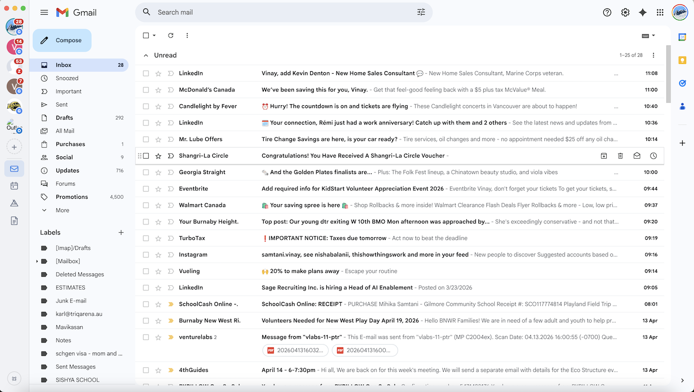

# Mailwing

> A native, multi-provider desktop email client built with Electron.

Mailwing wraps Gmail, Outlook Web, Zoho Mail, Fastmail, Yahoo Mail, and ProtonMail — along with their companion apps — in a single native window. Each account gets a fully isolated browser session, a live unread badge, and desktop notifications that click straight to the right inbox.

[](LICENSE)
[](https://www.electronjs.org/)
[]()
[](https://github.com/vinaysamtani/mailwing/actions/workflows/release.yml)
[](https://github.com/vinaysamtani/mailwing/releases/latest)

---

## Download

| Platform | Link |
|---|---|
| **macOS** (Universal – Intel + Apple Silicon) | [Download .dmg](https://github.com/vinaysamtani/mailwing/releases/latest) |
| **Windows** | [Download .exe](https://github.com/vinaysamtani/mailwing/releases/latest) |
| **Linux** | [Download .AppImage](https://github.com/vinaysamtani/mailwing/releases/latest) |
| **Homebrew** (macOS) | `brew install --cask vinaysamtani/mailwing/mailwing` |

All releases are built automatically by CI on every tag push — see [Releases](https://github.com/vinaysamtani/mailwing/releases).

---

## macOS — first-launch security prompt

Because Mailwing is an open-source project distributed outside the Mac App Store and without an Apple Developer certificate, macOS Gatekeeper will block it from opening directly by double-click.

**To open the app (one-time only):**

**Option 1 — Right-click (easiest)**
1. Right-click (or Control-click) the `Mailwing.dmg` or `Mailwing.app`
2. Choose **Open** from the context menu
3. Click **Open** in the dialog that appears
4. macOS remembers this choice — subsequent launches work normally

**Option 2 — Privacy & Security settings**
1. Try to open the app normally — macOS will block it and show an alert
2. Open **System Settings → Privacy & Security**
3. Scroll down to the "Security" section and click **Open Anyway**
4. Authenticate if prompted

**Option 3 — Terminal (advanced)**
```bash
xattr -rd com.apple.quarantine /Applications/Mailwing.app
```

> This is expected behaviour for unsigned apps distributed outside the Mac App Store. It is a one-time step — the app opens normally on every subsequent launch.

---

## Screenshot



---

## Features

| Feature | Details |
|---|---|
| **Multi-provider** | Google (Gmail, Calendar, Drive, Docs), Outlook (Mail, Calendar, OneDrive, People), Zoho (Mail, Calendar, WorkDrive, Writer), Fastmail (Mail, Calendar, Contacts), Yahoo (Mail, Calendar), ProtonMail (Mail, Calendar, Drive) |
| **Multiple accounts** | Add any number of accounts per provider; each gets a fully isolated session (cookies, localStorage, login state) |
| **Live unread badges** | Inbox counts shown on account buttons, the macOS dock icon, and the system tray |
| **Desktop notifications** | Native OS notifications when new mail arrives; click to jump to the right inbox |
| **System tray** | Quick-access menu for all accounts; app persists when the window is closed on macOS |
| **mailto: handler** | Registers as the default mail client; clicking `mailto:` links anywhere opens a compose window |
| **Ad & tracker blocking** | Network-level request filter that leaves all provider domains untouched |
| **Dark mode** | Follows the OS light/dark preference automatically |
| **Window state** | Remembers size, position, and maximised state between launches |
| **Drag-to-reorder** | Drag account avatars in the sidebar to rearrange them |
| **Accent colours** | Right-click any account to assign a custom colour or remove it |
| **Keyboard shortcuts** | Switch accounts and reload the active view without touching the mouse |
| **Cross-platform** | macOS (Intel + Apple Silicon), Windows, Linux |

---

## Requirements

- [Node.js](https://nodejs.org/) 18 or later
- npm 8 or later

---

## Installation

```bash
# 1. Clone the repo
git clone https://github.com/vinaysamtani/mailwing.git
cd mailwing

# 2. Install dependencies
#    (postinstall automatically generates the app icons in build/)
npm install

# 3. Launch
npm start
```

On first launch the sidebar is empty — click **+** to add your first account.

---

## Adding accounts

1. Click the **+** button at the bottom of the sidebar
2. Choose a provider from the native popup menu
3. Sign in through the page that opens; sessions are isolated per account
4. Your avatar and live unread count appear automatically after login
5. Right-click any avatar to change its accent colour or remove the account
6. Drag avatars to reorder them in the sidebar

---

## Keyboard shortcuts

| Shortcut | Action |
|---|---|
| `Cmd/Ctrl` + `1` | Switch to account 1 |
| `Cmd/Ctrl` + `2` | Switch to account 2 |
| `Cmd/Ctrl` + `3` – `9` | Switch to accounts 3 – 9 |
| `Cmd/Ctrl` + `R` | Reload the current view |

---

## Packaging for distribution

```bash
npm run dist           # build for the current platform
npm run dist:mac       # macOS DMG (universal: x64 + arm64)
npm run dist:win       # Windows NSIS installer
npm run dist:linux     # Linux AppImage
```

Built artefacts land in `dist/`. `electron-builder` is already listed in `devDependencies`.

> **Cross-compiling** (e.g. building a Windows installer on macOS) requires additional tooling. See the [electron-builder multi-platform docs](https://www.electron.build/multi-platform-build).

---

## Setting Mailwing as your default mail client

| Platform | Steps |
|---|---|
| **macOS** | The OS prompts you automatically the first time a `mailto:` link is opened |
| **Windows** | Settings → Default apps → Email → select Mailwing |
| **Linux** | `xdg-settings set default-url-scheme-handler mailto mailwing` |

---

## Project structure

```
src/
  shared/
    constants.js        IPC channel names and shared constants
    providers.js        Provider registry — the only file to edit when adding a provider
  main/
    index.js            App bootstrap, window creation, mailto: handling
    accounts.js         Account CRUD (persisted via electron-store)
    viewManager.js      BrowserView lifecycle and layout management
    sessionManager.js   Per-account session partitions and ad-block hooks
    adBlockList.js      Ad/tracker domain blocklist
    tray.js             System tray and macOS dock badge
    notifications.js    Desktop notification firing and click routing
    windowState.js      Window size/position persistence
    darkMode.js         nativeTheme watcher
    ipcHandlers.js      All IPC channel registrations
  renderer/
    index.html          Sidebar shell HTML
    preload.js          contextBridge API exposed to the renderer as window.mailwing
    renderer.js         Sidebar logic, account/service switching, keyboard shortcuts
    styles.css          Sidebar layout and dark-mode styles
scripts/
  generate-icons.js     Generates PNG icons at build time (runs as postinstall)
build/                  Generated icons (git-ignored; recreated by npm install)
```

---

## Adding a new provider

All provider configuration lives in `src/shared/providers.js`. No other files need changing — add a new key to the `PROVIDERS` object:

```js
myProvider: {
  id:    'myProvider',
  label: 'My Provider',
  color: '#ff0000',                          // sidebar accent colour

  services: [
    { id: 'mail',     label: 'Mail',     url: 'https://mail.example.com' },
    { id: 'calendar', label: 'Calendar', url: 'https://calendar.example.com' },
  ],
  defaultService: 'mail',

  // Extract unread count from the page title
  unreadTitleRegex: /\((\d+)\)/,

  // JS snippet injected into the mail page for DOM-based unread polling
  unreadScript: `(function(){
    var el = document.querySelector('.unread-count');
    return el ? parseInt(el.textContent, 10) : -1;
  })()`,

  // CSS selector for the user avatar 
  avatarSelector: '.avatar img',

  // Build the compose URL for mailto: links
  mailtoComposeUrl: (rawUrl) =>
    \`https://mail.example.com/compose?mailto=\${encodeURIComponent(rawUrl)}\`,

  // Domains the ad-blocker must never block
  safeDomains: ['example.com'],
},
```

---

## Contributing

Contributions are welcome. A few guidelines:

- **Fork** the repository and create a feature branch from `main`.
- **Keep changes focused** — one feature or fix per pull request.
- **Test manually** on the platforms your change affects.
- **No build step** — the project is plain CommonJS; avoid introducing a transpiler or bundler.
- **Open an issue first** for significant changes so the approach can be discussed before you invest time in an implementation.

To report a bug, open a GitHub issue with:
1. Your OS and version
2. Steps to reproduce
3. What you expected vs. what actually happened

---

## License

[MIT](LICENSE)
